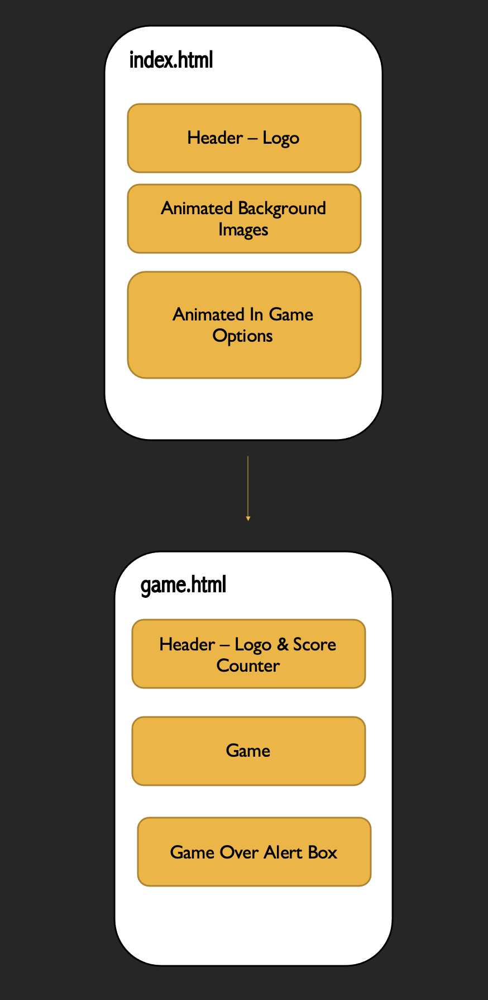

# SPACESCAPE

[View Live Website Here](https://farisgjd.github.io/spacescape/)

# Table Of Contents

1. [Introduction](#introduction)
2. [User Experience](#user-experience)
    * [Site & User Goals](#site-&-user-goals)
    * [User Stories](#user-stories)    
3. [Development Planes](#development-planes) 
    * [Strategy](#strategy)
        * [Demographics](#demographics)
        * [Psychographics](#psychographics)
        * [Trade-off Equation](#trade-off-equation)
    * [Scope](#scope)
        * [Content Requirements](#content-requirements)
        * [Functional Specifications](#functional-specifications)
    * [Structure](#structure)
    * [Skeleton](#skeleton)
    * [Surface](#surface)
        * [Colour Scheme](#colour-scheme)
        * [Typography](#typograpnhy)
        * [Imagery](#imagery)
        * [Features](#features)
4. [Technologies Used](#tech-used)
5. [Search Engine Optimization](#seo)
6. [Bugs & Issues](#bugs)
7. [Testing](#testing)
    * [Device Testing](#device-testing)
    * [Browser Testing](#browser-testing)
    * [Peer Review Testing](#peer-review-testing)
    * [User Stories Testing](#user-stories-testing)
8. [Validation](#validation)
    * [HTML Validator](#html-validator)
    * [CSS Validator](#css-validator)
    * [Google Mobile-Freindly Test](#google-mobile-freindly-test)
    * [Lighthouse](#lighthouse)
9. [Deployment](#deployment)
    * [Repository Forking](#repository-forking)
    * [Repository Cloning](#repository-cloning)
10. [Credits](#credits)
11. [Acknowledgements](#aknowledgements)

***
# Introduction

Video gaming is one of the world’s most popular pastimes, with an estimated 2.8 billion gamers worldwide. On average users spend nearly 9 weekly hours playing video games, signifying a huge demand (Statista, 2021). This is especially true for web and mobile gaming, whose collective market penetration accounts for 71% of the world’s total (Wijman, 2020). These factors coupled with rapid growth and mainstream appeal have flooded the market with an influx of new entrants, heralding ascension of opportunities but also challenges.  

The current gaming sector is over saturated, with a vast majority of competitors fixated on developing the latest ultra-high-resolution software, leaving a gap in the market (Newzoo, 2020). Retrogaming has had a poignant resurgence due to the preponderance of gamers being roughly 34 years old. This coupled with the phenomenon of nostalgia has driven users to seek memories of old in terms of graphics, sound and gameplay (Wulf et al, 2018). Gaming giants such as Nintendo, Sony & Sega have begun to both quash and exploit this by shutting down websites hosting old games code while planning to release their own back catalogue on new platforms (Doyoon, 2020 & Wulf et al, 2018).

Spacescape challenges this as it is an 8-bit, intergalactic themed, platform game in which the core objective is to manoeuvre the player sprite between obstacles avoiding contact resulting in death. Its ethos is to reintroduce Retrogaming to young and old users alike, quashing the nostalgia or interest they crave. Its mission is to provide users with a cross-platform, online emulator quest indicative of the 90’s style gameplay. This combined with an interstellar action storyline, modern technology and retro gameplay makes Spacescape unique within the market place. 

[Back To Top](#spacescape)

***
# User Experience 
## Site & User Goals 
### Site Goals
-	Reintroduce Retrogaming in terms of graphics, sound and functionality to a diverse demographic.
-	Provide users with a fun, engaging and non-repetitive intergalactic platform quest. 
-	Have a high level of cross-platform functionality such as keyboard commands (desktop & laptop) and touch enable devices (smartphones and tablets).
-	Develop a core client base for future updates and releases.  
### User Goals 
-	Address their nostalgia or interest for Retrogaming. 
-	Play a game that is engaging, fun and ranges in difficulty. 
-	Access the game on a range of devices while at home or on the go.

## User Stories 
-	As a First Time Visitor, I want to immediately understand the main purpose of the site in order to discover what is on offer.  
-	As a First Time Visitor, I want to instinctively access the different parts of the site so I can understand the game story, controls (instructions) and mechanics.  
-	As a Returning Visitor, I want to play the game with comprehensive knowledge of its controls and storyline.   
-	As a Returning Visitor, I want to compare the sites offerings to competitors as to determine their unique selling proposition. 
-	As a Frequent User, I want to progress through the game and compare its relation to my score. 
-	As a Frequent User, I want to test the sites responsiveness so that I can access it on different devices. 
-	As a Frequent User, I want to have fun and feel motivated to play the game over so I can tell others about the charm of Retrogaming. 

[Back To Top](#spacescape)

***
# Development Planes 
## Strategy
The leading strategy behind Spacescape is to introduce or re-establish Retrogaming to the diverse demographics of the gaming sector. Spacescape aims to leverage its individualistic design so that it can exploit the gap within the gaming market and as a result develop and increase a client base for future releases. 
Spacescape will target the following user attributes acquired from various cross-sectional studies regarding the gaming population (GamingScan, 2021, FinacesOnline, 20201) : 

## Demographics
-	Ages 6 – 65 (the most significant age group is the 18 – 35 y/o).
-	All genders (54% male 46% female).
-	All ethnicities and religions.
-	Mobile & PC gamers (on the go or at home players). 
-	Tech literate and illiterate 

## Psychographics
-	Interest in gaming (specifically action which accounts for 26.9% of sales).
-	Seeking Retrogaming options. 
-	Novice – veteran in Retrogaming (especially the platform sub-genre).
-	Nostalgic.
-	Seeking a different gaming experience than the current norm. 
-	Looking for mental stimulation.
-	Need relief from stress and relaxation. 

The website *needs* to enable the **User** to: 
-	Play the platform game with no issues. 
-	Receive feedback , validation and conformation throughout the site. 
-	Understand the story, rules and mechanics of the game and site.
-	Use the game on a variety of devices. 

The website *needs* to enable the **Client** to: 
-	Enter the Retrogaming market by developing an online presence. 
-	Showcase a unique, intergalactic, action platform game cultivating and increasing site traffic.
-	Have a high level of accessibility especially on computers and mobile devices. 

## Trade-off Equation: Importance VS Viability/Feasibility
Based on the user needs and business objectives a trade-off analysis was conducted, ranking Spacescape opportunities. Forecasts are classified in terms of their importance versus viability/feasibility as seen below. 

[Back To Top](#spacescape)

***
# Scope
Spacescape’s initial public offering is to deploy a Minimal Viable Product in terms of content, gameplay, accessibility and functionality. A scope was developed through an agile methodology which was founded off the strategy and divided into content requirements and functional specifications. 

## Content Requirements:
-	Clear 8-bit design indicative of Retrograming in terms of images and gameplay. 
-	Game that responds to user inputs and offers respective outputs. 
-	Must include: 
- Sprite (astronaut).
- Obstacles (e.g., asteroids) 
- Increase in difficulty (which will invoke more obstacles like fiery asteroids, aliens, spaceships and planets. 
- Mission control modal informing the user about the game and site story/mechanics.
- Score counter. 

## Functional Specifications:
-	Quick loading of the site and its content. 
-	Intuitive navigation.
-	Fully functioning and interactive game including its controls, score counter and end game detection. 
-   Site offers respective feedback, conformation and validation. 
-	Cross-platform accessibility. 
-	Search Engine Optimisation. 

[Back To Top](#spacescape)

***

# Structure
The inception of Spacescape resulted from the gap in the market for Retrogaming which means showcasing a game symbolic of this is of the highest priority. Therefor a hierarchical tree structure is implemented to arrange the site which reduces complexity, instantly allowing the user access to the game. Furthermore through research this was deemed best for gamming. 

### index.html:
-	Header – introduces the SPACESCAPE logo, giving the user a first glimpse into the theme behind the game. 
-	 Animated Background Images – both indicative of the overall premiss and style of the game, confirming the user’s expectations. 
-	Animated In Game Options – act as a navigation for the user as well as introducing the story behind the game. 

### game.html:
-	Header – keeps with the consistency of the site and a navigation to the home page. 
-	Game – the main landscape of the site which includes interactive and responsive player sprite and obstacles. 
-	Game Over Alert Box – validates and gives feedback to the user such as game over, score and restarts the page. 

[Back To Top](#mindx)

***
# Skeleton 
Balsamic was used to create wireframes, thus determining the basic navigation and design interface of the site. Since Spacescape’s appeal and exclusivity leverages the Retrogaming standard, a simple layout as well stylistic choices suggestive of this are implemented. For example, games such as Super Mario All-Stars (1993), The Legend Of Zelda A Link To The Past (1992) and Street Fighter II Turbo (1992) etc… all implore a basic navigation and controls, 16-bit graphics, garish yet complementary colours and animations. Finally, since Spacescape is a game, confirmation, validation and feedback are extremely important to the overall functionality and user experience.  

### Balsamic Wireframes:
  

  

  

  
 

[Back To Top](#mindx)

***
# Surface

## Colour Scheme  
Spacescape uses a rich and varied colour story as expected with retro gamming, specifically 8bit. The main colour pairings are #76f6f0, #2392d2, #006aaf, #004891, #022345 which are all different shades of blue emulating the coldness of deep space as well as reflecting the background image. 

The next colour grouping is #ffdd5c, #feaf34, #fea200, #fb6a04 and #ff5100 which range from yellow to orange and mimic a spaceships flame and are used for validation to suggest something is action (blasting off). They also act as a tease colour story for future releases. 

Finally #00000, #ffffff and #ff3e4f are used as accents (e.g. font colours and further validation). 
