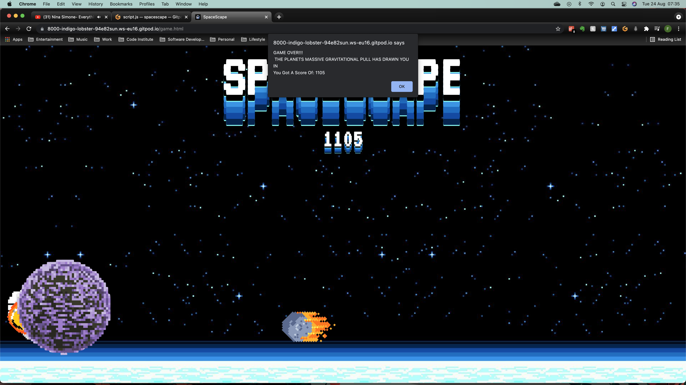
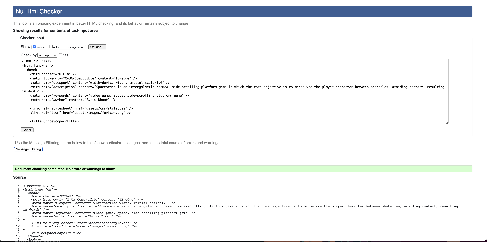

# SPACESCAPE

[View Live Website Here](https://farisgjd.github.io/spacescape/)

# Table Of Contents

1. [Introduction](#introduction)
2. [User Experience](#user-experience)
    * [Site & User Goals](#site-&-user-goals)
    * [User Stories](#user-stories)    
3. [Development Planes](#development-planes) 
    * [Strategy](#strategy)
        * [Demographics](#demographics)
        * [Psychographics](#psychographics)
        * [Trade-off Equation](#trade-off-equation)
    * [Scope](#scope)
        * [Content Requirements](#content-requirements)
        * [Functional Specifications](#functional-specifications)
    * [Structure](#structure)
    * [Skeleton](#skeleton)
    * [Surface](#surface)
        * [Colour Scheme](#colour-scheme)
        * [Typography](#typography)
        * [Imagery](#imagery)
        * [Features](#features)
4. [Technologies Used](#technologies-used)
5. [Search Engine Optimization](#search-engine-optimization)
6. [Bugs & Issues](#bugs-&-issues)
7. [Testing](#testing)
    * [Device Testing](#device-testing)
    * [Browser Testing](#browser-testing)
    * [Peer Review Testing](#peer-review-testing)
    * [User Stories Testing](#user-stories-testing)
8. [Validation](#validation)
    * [HTML Validator](#html-validator)
    * [CSS Validator](#css-validator)
    * [JavaScript Validator](#javascript-validator)
    * [Google Mobile-Freindly Test](#google-mobile-freindly-test)
    * [Lighthouse](#lighthouse)
9. [Deployment](#deployment)
    * [Repository Forking](#repository-forking)
    * [Repository Cloning](#repository-cloning)
10. [Credits](#credits)
11. [Bibliography](#Bibliography)

***
# Introduction

Video gaming is one of the world’s most popular pastimes, with an estimated 2.8 billion gamers worldwide. On average users spend nearly 9 weekly hours playing video games, signifying a huge demand (Statista, 2021). This is especially true for web and mobile gaming, whose collective market penetration accounts for 71% of the world’s total (Wijman, 2020). These factors coupled with rapid growth and mainstream appeal have flooded the market with an influx of new entrants, heralding ascension of opportunities but also challenges.  

The current gaming sector is over saturated, with a vast majority of competitors fixated on developing the latest ultra-high-resolution software, leaving a gap in the market (Newzoo, 2020). Retrogaming has had a poignant resurgence due to the preponderance of gamers being roughly 34 years old. This coupled with the phenomenon of nostalgia has driven users to seek memories of old in terms of graphics, sound and gameplay (Wulf et al, 2018). Gaming giants such as Nintendo, Sony & Sega have begun to both quash and exploit this by shutting down websites hosting old games code while planning to release their own back catalogue on new platforms (Doyoon, 2020 & Wulf et al, 2018).

Spacescape challenges this as it is an 8-bit, intergalactic themed, platform game in which the core objective is to manoeuvre the player sprite between obstacles avoiding contact resulting in death. Its ethos is to reintroduce Retrogaming to young and old users alike, quashing the nostalgia or interest they crave. Its mission is to provide users with a cross-platform, online emulator quest indicative of the 90’s style gameplay. This combined with an interstellar action storyline, modern technology and retro gameplay makes Spacescape unique within the market place. 

[Back To Top](#spacescape)

***
# User Experience 
## Site & User Goals 
### Site Goals
-	Reintroduce Retrogaming in terms of graphics, sound and functionality to a diverse demographic.
-	Provide users with a fun, engaging and non-repetitive intergalactic platform quest. 
-	Have a high level of cross-platform functionality such as keyboard commands (desktop & laptop) and touch enable devices (smartphones and tablets).
-	Develop a core client base for future updates and releases.  
### User Goals 
-	Address their nostalgia or interest for Retrogaming. 
-	Play a game that is engaging, fun and ranges in difficulty. 
-	Access the game on a range of devices while at home or on the go.

## User Stories 
-	As a First Time Visitor, I want to immediately understand the main purpose of the site in order to discover what is on offer.  
-	As a First Time Visitor, I want to instinctively access the different parts of the site so I can understand the game story, controls (instructions) and mechanics.  
-	As a Returning Visitor, I want to play the game with comprehensive knowledge of its controls and storyline.   
-	As a Returning Visitor, I want to compare the sites offerings to competitors as to determine their unique selling proposition. 
-	As a Frequent User, I want to progress through the game and compare its relation to my score. 
-	As a Frequent User, I want to test the sites responsiveness so that I can access it on different devices. 
-	As a Frequent User, I want to have fun and feel motivated to play the game over so I can tell others about the charm of Retrogaming. 

[Back To Top](#spacescape)

***
# Development Planes 
## Strategy
The leading strategy behind Spacescape is to introduce or re-establish Retrogaming to the diverse demographics of the gaming sector. Spacescape aims to leverage its individualistic design so that it can exploit the gap within the gaming market and as a result develop and increase a client base for future releases. 
Spacescape will target the following user attributes acquired from various cross-sectional studies regarding the gaming population (GamingScan, 2021, FinacesOnline, 20201) : 

## Demographics
-	Ages 6 – 65 (the most significant age group is the 18 – 35 y/o).
-	All genders (54% male 46% female).
-	All ethnicities and religions.
-	Mobile & PC gamers (on the go or at home players). 
-	Tech literate and illiterate 

## Psychographics
-	Interest in gaming (specifically action which accounts for 26.9% of sales).
-	Seeking Retrogaming options. 
-	Novice – veteran in Retrogaming (especially the platform sub-genre).
-	Nostalgic.
-	Seeking a different gaming experience than the current norm. 
-	Looking for mental stimulation.
-	Need relief from stress and relaxation. 

The website *needs* to enable the **User** to: 
-	Play the platform game with no issues. 
-	Receive feedback , validation and conformation throughout the site. 
-	Understand the story, rules and mechanics of the game and site.
-	Use the game on a variety of devices. 

The website *needs* to enable the **Client** to: 
-	Enter the Retrogaming market by developing an online presence. 
-	Showcase a unique, intergalactic, action platform game cultivating and increasing site traffic.
-	Have a high level of accessibility especially on computers and mobile devices. 

## Trade-off Equation: Importance VS Viability/Feasibility
Based on the user needs and business objectives a trade-off analysis was conducted, ranking Spacescape opportunities. Forecasts are classified in terms of their importance versus viability/feasibility as seen below. 

[Back To Top](#spacescape)

***
# Scope
Spacescape’s initial public offering is to deploy a Minimal Viable Product in terms of content, gameplay, accessibility and functionality. A scope was developed through an agile methodology which was founded off the strategy and divided into content requirements and functional specifications. 

## Content Requirements:
-	Clear 8-bit design indicative of Retrograming in terms of images and gameplay. 
-	Game that responds to user inputs and offers respective outputs. 
-	Must include: 
- Sprite (astronaut).
- Obstacles (e.g., asteroids) 
- Increase in difficulty (which will invoke more obstacles like fiery asteroids, aliens, spaceships and planets. 
- Mission control modal informing the user about the game and site story/mechanics.
- Score counter. 

## Functional Specifications:
-	Quick loading of the site and its content. 
-	Intuitive navigation.
-	Fully functioning and interactive game including its controls, score counter and end game detection. 
-   Site offers respective feedback, conformation and validation. 
-	Cross-platform accessibility. 
-	Search Engine Optimisation. 

[Back To Top](#spacescape)

***

# Structure
The inception of Spacescape resulted from the gap in the market for Retrogaming which means showcasing a game symbolic of this is of the highest priority. Therefor a hierarchical tree structure is implemented to arrange the site which reduces complexity, instantly allowing the user access to the game. Furthermore through research this was deemed best for gamming. 

### index.html:
-	Header – introduces the SPACESCAPE logo, giving the user a first glimpse into the theme behind the game. 
-	 Animated Background Images – both indicative of the overall premiss and style of the game, confirming the user’s expectations. 
-	Animated In Game Options – act as a navigation for the user as well as introducing the story behind the game. 

### game.html:
-	Header – keeps with the consistency of the site and a navigation to the home page. 
-	Game – the main landscape of the site which includes interactive and responsive player sprite and obstacles. 
-	Game Over Alert Box – validates and gives feedback to the user such as game over, score and restarts the page. 

[Back To Top](#spacescape)

***
# Skeleton 
Balsamic was used to create wireframes, thus determining the basic navigation and design interface of the site. Since Spacescape’s appeal and exclusivity leverages the Retrogaming standard, a simple layout as well stylistic choices suggestive of this are implemented. For example, games such as Super Mario All-Stars (1993), The Legend Of Zelda A Link To The Past (1992) and Street Fighter II Turbo (1992) etc… all implore a basic navigation and controls, 16-bit graphics, garish yet complementary colours and animations. Finally, since Spacescape is a game, confirmation, validation and feedback are extremely important to the overall functionality and user experience.  

### Balsamic Wireframes:
  

  

  

  
 

[Back To Top](#spacescape)

***
# Surface

## Colour Scheme  
Spacescape uses a rich and varied colour story as expected with retro gamming, specifically 8bit. The main colour pairings are #76f6f0, #2392d2, #006aaf, #004891, #022345 which are all different shades of blue emulating the coldness of deep space as well as reflecting the background image. 

The next colour grouping is #ffdd5c, #feaf34, #fea200, #fb6a04 and #ff5100 which range from yellow to orange and mimic a spaceships flame and are used for validation to suggest something is action (blasting off). They also act as a tease colour story for future releases. 

Finally #00000, #ffffff and #ff3e4f are used as accents (e.g. font colours and further validation). 

## Typography
Two different fonts are used throughout the site which were deliberate stylistic choices. The first VT323, an obvious choice as it is a pixelated style and has a font weight of 400 so excellent for important pieces of information (logo, score counter and player options headings). The next was Orbitron which imitates the text style within old school terminals and a complementary choice for large chunks of text. This said both fonts don’t have a default font family which made it hard to choose a web-safe font. In the end a simple sans-serif font was used, the same done in the 90’s.  

## Imagery
The images used within Spacescape strictly follow the 8-bit (pixilated) and space themes, respectively and are used to tell a story. For example, the spaceship on the home page orbiting the planet Kepler-452b follows the story told within the rule’s modal and sets the beginning of the game. Next when the user clicks play, and is greeted with the astronaut (sprite) and various interplanetary obstacles which also reflect the story within the modal and informs them that game is starting. 

## Features
### Header
-	Logo – introduces Spacescapes identity and begins to open the users mind for what is ahead. Also acts as a navigation to the home page within the game page. 
-	Score Counter – visual cue to the user that this is a game and is one of the main aspects of the site that gives the user constant feedback. 

### Background Image 
-	Background Image – used to tie in the story told within the rules modal and sets the stage for the game. It is also animated, echoing the movement in space as well as makes the game more dynamic. 

### index.html
-	Player Controls – The play button initiates the game by directing the user to the games page. The rules button opens up a terminal style modal which fully explains the back story of the game in addition to the rules of how of play on various devices. The buttons are also animated to replicate zero-gravity adding to the overall theme and indicate responsiveness to the user when hovered over. 

### game.html 
-	Game Landscape – contains the player sprite and various obstacles. This was designed specifically to get harder as the score counter increased meaning more obstacles in varying sizes and speeds spawning. 
-	Alert – finally when the user loses a game over alert appears with their score and varying messages from each obstacle. The alert was deliberately not designed and left as the computers default, again reflecting the old style game play. 

### Features To Implement
-	Game background sounds (e.g. sprite and obstacle effects). 
-	Increase in difficulty and as a result a settings modal. 
-	Background, logo and score counter change colour periodically. 
-	Ability for sprite to shoot laser, eliminating obstacles. 

[Back To Top](#spacescape)

***
# Technologies Used 
-	HTML5 – Programming Language.
-	CSS3 – Programming Language.
-	JavaScript – Programming Language. 
-	Google Fonts – typography.
-	GitHub – cloud based hosting service, managing repositories.
-	GitPod – integrated development environment used to develop project. 
-	Git – version control tool 
-	Code Institute GitPiod Template – provides GitPod extensions making code creating easier and manageable.
-	Google Chrome Development Tools – used for debugging and in browser editing. 
-	Coolers – colour pallet generator. 
-	Photoshop – editing of site photos. 
-	Compress PNG – compress images for optimum usage. 
-	Balsamic – create wireframes. 
-	Favicon – used to create favicon. 
-	Lighthouse – website performance review. 
-	Web Formatter – formatting, HTML, CSS & JavaScript code. 
-	W3C Validator – validate HTML & CSS code. 
-	JavaScript Validator – validate JavaScript code. 
-	Pinetools – image to pixel converter. 

[Back To Top](#mindx)

***
# Search Engine Optimization
Various SEO techniques were implemented in order to prove the quantity and quality of traffic towards the site from search engines. 
-	Crawlable Links. 
-	Keyword and Meta Description tags have been used within the head of each page, creating better relationships between Spacescape and search engines. 

[Back To Top](#mindx)

***
# Bugs & Issues
-	Player options ridge border was not taking the coded colour (#000000) on smaller screen sizes. The bug has not been resolved but upon closer inspection looked better than the original idea so was kept. 
-	Original player settings options was an image and named mission control. This was slowing down the speed of the site since a lot of images were used and was deemed unimportant. 
-	Landscape orientation (mobile devices) was causing a lot of issues so max-height media queries were implemented to combat this.  
-	Spaceship and obstacle animations were causing the page to scroll horizontally creating a bad user experience. This was resolved by using overflow hidden. 
-	Spaceship animation stopping in the middle of smaller screen sizes which was due to the animation being given a viewport width value rather than a percentage (which resolved the problem). 
-	Player controls were too big at laptop screen sizes due to its container overflowing. This caused issues since overflow hidden was used to address the spaceship overflow which meant some of the buttons could not be accessed. To resolve these special media queries were used to target laptop screens in addition to player options given a horizontal flex orientation rather than vertical. 
-	Initially the sprite had a zero-gravity animation similar to the player options. This was causing issues with the JavaScript code to make the sprite jump which meant the initial animation had to be removed. 
-	Collision detection was another problem as the computer was used to calculate the distance between the top of the sprite and the left of the obstacle. This caused issues as obstacles ranged in size and speed meaning it was not getting a 100% accurate reading. To resolve this, various speeds, size changes, sprite jump height and JavaScript measurements were tweaked to get the best overall result. 
-	Finally on mobile landscape orientation the collision detection was not working meaning more tweaks as above. 

[Back To Top](#spacescape)

***
# Testing 
Each section of the site and overall game were tested for responsiveness, validation, feedback and conformation during and after completion. This was mainly done using Google Chrome Developer Tools, especially the console to help debug JavaScript code and the adaptable display for media queries. Below are examples of what each section was tested for: 

### Header
-	Logo redirects to home page. 
-	Score counter increments players progress. 

### Background Images 
-	Image animation moves at a consistent speed on all screen sizes. 
-	Animation overflow not activating the browsers default scroll property. 

### index.html 
-	Player options change colour when hovered over. 
-	Play button functions and redirects to correct location. 
-	Rules modal responds to users’ inputs. 

### game.html 
-	Sprite jump function is at a reasonable and consistent height on all screen sizes. 
-	Obstacles move at a steady speed on all screen sizes (not too fast, not too slow). 
-	Game over detection works as best it can. Some discrepancies are apparent due to the computer constantly calculating both sprite and obstacle position which is affected by screen sizes. 
-	Game over alert gives the correct message for its relevant obstacle. 
-	Game reloads when the user loses and score counter decreases to 0 and starts again. 

## Device Testing 
Spacescape relies heavily on device accessibility for a good user experience. This is especially true for the gameplay which is stringent when it comes to sizing discrepancies which would render the game useless if not addressed. Furthermore, the mechanics (JavaScript) of the game were also specific to dramatic size differences from what they were originally coded for (Desktop). Therefore, different device sizes were tested to ensure the game function as intended. 

### Desktop/Tablet
These were the easiest and least problematic of the defined screens as they had a good width – height ratio. As a result, testing was minimal. The only issue arose was sizing of different elements which was as expected. 

### Laptop
As mentioned previously laptops caused an issue in terms of the player controls which is why custom media queries based off of popular screen sizes were used to address this – 1200px(w) & 800px (h), 1366px(w) & 768px (h), 1600px (w) & 900px (h) and 1024px width & 768px (h). 

### Mobile
This caused the biggest issue for the overall game as the dramatic sizing ratios at times caused the game to be useless. The game had to be re tweaked several times for the different screen sizes and a middle ground compromise was made. This means that the game over detection might not work at 100% accuracy but the opportunity cost of cross device functionality could not be forgone. 

Another issue was landscape orientation which Spacescape would rely heavily on as this was a popular was mobile games would play. Therefore, specific max-height media queries were implemented to cater to this – 540px, 450px, 400px, 370px and 320px. A big lesson learned from this was for a site such as Spacescape (game) designing for mobile first would have been a smarter choice. 

## Browser Testing 
The site was tested on the following browsers to check for compatibility: 
-	Chrome (created on) 
-	Firefox 
-	Safari 
All browsers worked fine except for when additional popups appeared such as when downloading things off the internet or when viewing the GitHub page on mobile screen which have the additional navigation at the bottom. This was fixed by moving elements closer to the middle. 

## Peer Review Testing 
Friends, family members and colleagues were asked to access the project through various means. The feedback was as mentioned previous: 
-	Screen popups shifting player sprite and obstacles. 
-	Sprite kept dying as collision detection was not addressed for all screen sizes. 
-	Player Controls were overflowing on laptop screens. 

## User Stories Testing 
### As a First Time Visitor: 
1.	When entering the site the user is greeted with the animated background image, logo and player controls all of which are space and retro game themed giving the gamer a clear snapshot view of what the site has to offer and its uniqueness. 
2.	The site uses a tree structure and follows on path to the game and another path back to the main page making the navigation easy. This is because Spacescape leverages the users prior experience in video gaming (play button) and website navigation (logo’s typically when clicked redirect to the home page). 
3.	The rules modal clearly states the story behind the game as well as the mechanics of how to play across all devices. 

### As a Returning Visitor: 
1.	Due to the sites simplistic and deliberate design the user is able to access the rules modal as well as the game and test or supplement their knowledge. 
2.	The site is unique in its offerings so the user can compare the sites offerings easily with that of competitors. 

### As a Frequent User: 
1.	The game gets difficult the longer you are alive which is then reflected in the incrementing score counter. 
2.	The site is highly responsive and is expected to be used on desktops, laptops, tablets & mobile devices in whatever orientation. 
3.	The game is challenging and combines a unique theme, storyline, gameplay and design so that the user feels motivated to return and tell others. 

[Back To Top](#spacescape)

***

# Validation 
The sites code was passed through various online validation and responsiveness tools to determine its competences:

## HTML Validator 
Both pages returned with no errors or warnings. 
### index.html
 

### game.html
 

## CSS Validator 
Returned with a few errors regarding the laptop specific media queries created for the site. Upon further research it was suggested to replace “device-width” and “device-height” with “max-width” or “max-height”. This would render the media queries useless and interact with the others so was left as is.  

## JavaScript Validator 
Stated that the arrow function used was only available in ES6 which was not an issue. 

## Google Mobile-Freindly Test 
Goolgle mobile freindly results came back as positive as seen below. 

## Lighthouse 
Lighthouse also came back positive. 

[Back To Top](#spacescape)

***
# Deployment
GitPod, a cloud based IDE was used to create, edit and preview the code for Spacescape. Git was used a version control tool to push the code into a GitHub repository which hosted the project and workspace. Finally the project is subsequently deployed using GitHub Pages. The process to do so is as follows:
1.	Locate the relevant GitHub repository.
2.	In the tab below the repository name click settings where you will be redirected to a new page. 
3.	The tab on the right-hand side contains several options, the desired is pages. 
4.	In the source section choose master from the first drop-down menu titled branch, then root from the second drop-down menu with a folder icon and finally save. 
5.	Once the process is complete the live URL will be displayed above with the text “Your site is published at”. 

Successively this code can be cloned or forked from the same GitHub repository. 

## Repository Forking 
Forking a repository simply means creating a copy of the original to be viewed and edited without effecting the source. To do so: 
1.	In GitHub locate the relevant repository. 
2.	In the top right-hand side, underneath the user icon click the fork button. 
3.	The forked repository should load and save to the GitHub account it was created on. 

## Repository Cloning 
GitHub repositories exist remotely online. Cloning a repository means you create a local copy on your computer and sync between the two locations. To do so: 
1.	Navigate to the main page of the desired repository. 
2.	Above the list of files click on the green code button. 
3.	You will be given the option to clone with HTTPS, SSH & GitHub CLI, chose the desired option, in this case desktop is where the clone will be housed. 
4.	Finally follow the prompts in GitHub desktop to complete the process. 

[Back To Top](#spacescape)

***
# Credits
**The functionality of the game was based on and heavily amended:**  
-	Code With Ania Kubow (Youtube). 
-	Keep Coding (Youtube). 

**General code help, inspiration and resources:**
-	Love Running Walkthrough Project 
-	W3S
-	CSS-Tricks
-	Stack Overflow 
-	Free Code Camp 

[Back To Top](#spacescape)

# Bibliography
1.	Clement. J, “Number of video gamers worldwide in 2020, by region”, Statista, 06/24/21, https://www.statista.com/statistics/293304/number-video-gamers/. 

2.	Clement J, “Average weekly hours spent playing video games in selected countries worldwide as of January 2021”, Statista, 04/23/21, https://www.statista.com/statistics/273829/average-game-hours-per-day-of-video-gamers-in-selected-countries/. 

3.	Tom Wijman,”The world’s 2.7 billion gamers will spend $159.3 billion on games in 2020; the market will surpass $200 billion by 2023”, Newzoo, 05/08/20, https://newzoo.com/insights/articles/newzoo-games-market-numbers-revenues-and-audience-2020-2023/. 

4.	Wulf. T, Bowman. N, Rieger. D, Velez. J, Bruer. J, “Video Games as Time Machines: Video Game Nostalgia and the Success of Retro Gaming”, Cogitatio Press, 2018. 

5.	Doyoon. K, “Retrogaming: The power of nostalgia”, HS Insider, 22/09/20, https://highschool.latimes.com/cleveland-charter-high-school/retrogaming-the-power-of-nostalgia/. 

6.	Bowman. N, Wulf. T, “Finding nostalgia in the pixelated video games of decades past”, The Conversation, 15/08/18, https://theconversation.com/finding-nostalgia-in-the-pixelated-video-games-of-decades-past-98518. 

7.	GamingScan, “2021 Gaming Industry Statistics, Trends & Data”, 06/21, https://www.gamingscan.com/gaming-statistics/. 

8.	FinancesOnline, “Number Of Gamers Worldwide 2021/2022: Demographics, Statistics, and Predictions, 2021. 

 

